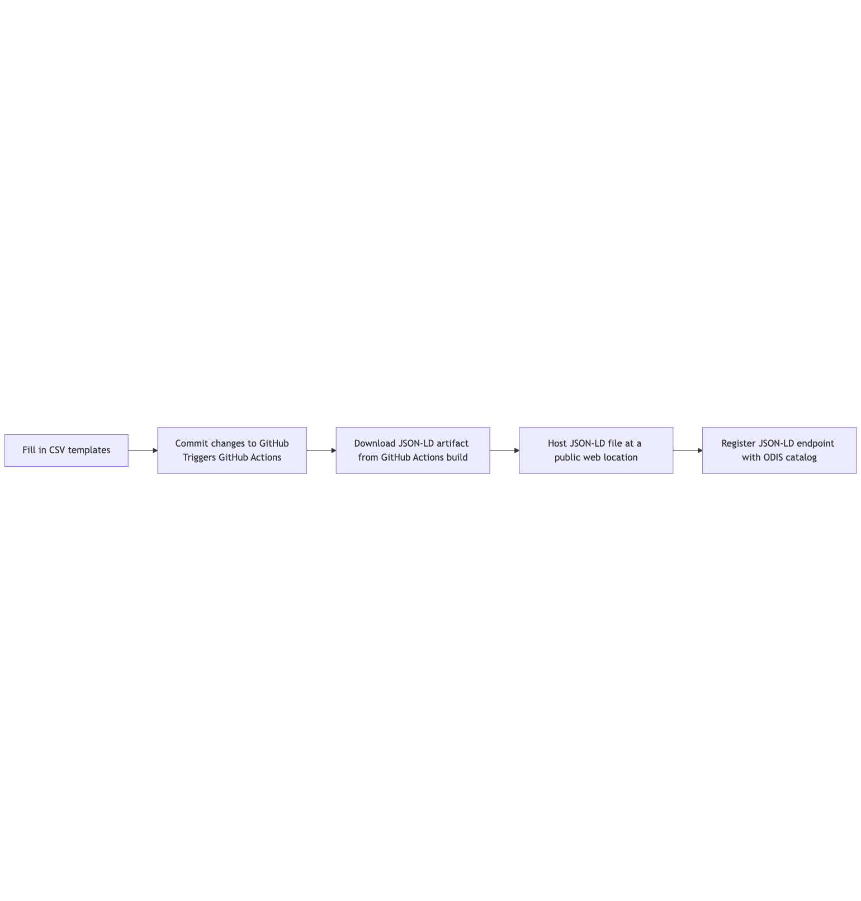

# MARCO-BOLO CSV-to-JSON-LD Tool

This repository provides the official metadata publishing tool for [**Work Package 1 (WP1)**](https://marcobolo-project.eu/work-packages/work-package-1) of the [**MARCO-BOLO** project](https://marcobolo-project.eu/), which focuses on improving data literacy and metadata flow across the project.

The tool enables researchers and data managers to convert structured metadata in CSV format into **JSON-LD** using the **Schema.org** vocabulary. The output is fully compatible with global discovery platforms like the [ODIS Catalog](https://catalog.odis.org/).

## Table of Contents

TBD

## 📚 Documentation & Resources

- [Rendered model documentation](http://lab.marcobolo-project.eu/csv-to-json-ld/index.html)
- [Table Dependency Viewer](./user_tools/dependency_viewer.html): See which tables are required or referenced for valid metadata records.

## How It Works

### Workflow Summary

_The user, usually a data manager, populates CSV templates in the GitHub repo (not clear yet if it should be a new branch or fork ([see GH issue #40](https://github.com/marco-bolo/csv-to-json-ld/issues/40)), and triggers building of JSON-LD documents by commiting those changes to the GitHub repo. The JSON-LD that is produced can be hosted and registered with ODIS to ensure the research products are discoverable._

The tool uses:

- **[LinkML](https://linkml.io/)** to define metadata models (e.g., Dataset, Person, Organization)
- **[CSV-W](https://csvw.org/)** metadata files to describe CSV structure
- A **[Makefile](https://opensource.com/article/18/8/what-how-makefile)** and **[GitHub Actions](https://github.com/features/actions)** to automate validation and transformation steps
- **[W3IDs](https://w3id.org/)** for stable context and schema identifiers of the metadata models.
- **[Schema.org](https://schema.org/)** as the target vocabulary for JSON-LD output

### Getting Started (No Installation Required)

You can contribute metadata to MARCO-BOLO directly in your browser — no need to install anything locally.

1. **Create a GitHub Account**  
   Go to [https://github.com/signup](https://github.com/signup) and create a free GitHub account.  
   Contact the Work Package 1 (WP1) team to be added to the MARCO-BOLO organization and granted editing permissions.  
   You won’t be able to contribute metadata until this is done.

2. **Set Up Your GitHub.dev Environment**  
   To edit metadata CSV files in a spreadsheet-like view:
   - Open the recommended GitHub.dev profile.
   - Click the “Create” button.
   - If prompted, trust and install the “Excel Viewer” extension from MESCIUS.
   - Tick the box: “Use this profile as the default for new windows”.

3. **Edit Metadata in the Repo**  
   Open the MARCO-BOLO metadata editor:  
   [https://github.dev/marco-bolo/csv-to-json-ld/tree/wp1-playground](https://github.dev/marco-bolo/csv-to-json-ld/tree/wp1-playground)  
   Sign in to GitHub when prompted and authorize GitHub.dev to access your account.  
   Browse to the relevant CSV file (e.g., `Dataset.csv`, `Person.csv`) and make edits using the table view.

4. **Commit and Push Your Changes**  
   - Go to the Source Control view (left-hand sidebar).
   - Enter a short message describing your edits.
   - Click **“Commit & Push”**.  
   This will trigger an automatic build of your metadata on GitHub Actions.

5. **Confirm Your Edits Were Valid**  
   - In the GitHub repository, switch to your working branch (e.g., `wp1-playground`).
   - Look for a build called `validate-csvws-build-jsonld`.  
   A ✅ green check mark means your changes passed validation.  
   A ❌ red cross means there were errors. If you feel comfortable diving into GitHub Action logs, we encourage your to try and diagnose the error yourself. If not, please contact the WP1 team for help.

6. **Download Your JSON-LD Output**  
   - In the build results, click **“Details”** on the `validate-csvws-build-jsonld` job.
   - In the summary view, download the ZIP artifact that contains the generated JSON-LD files.  

   ℹ️ *Note: These artifacts are temporary and will expire after 90 days.  
   Be sure to store the files elsewhere for long-term access.*

## Hosting and Registration

To make your metadata discoverable by ODIS:

1. **Host the generated JSON-LD** at a stable public URL (e.g., through GitHub Pages).
2. **[Register the resource with ODIS](https://book.odis.org/gettingStarted.html#quick-steps)** so it can be harvested and indexed.

## ✅ Required Fields and Validation Rules

Each CSV template has fields marked as **required**, and some fields must also follow **validation rules** (e.g., format restrictions or uniqueness constraints). These ensure your metadata is structured correctly and interoperable with global catalogs like [ODIS](https://catalog.odis.org).

## Required Table Terms and Relationships

Before filling out any MARCO-BOLO CSV tables, it's important to understand which terms are required and how they depend on each other. 

#### Universally Required Fields

| Field                        | Meaning                                                                 |
|-----------------------------|-------------------------------------------------------------------------|
| `id`                        | A unique permanent identifier (e.g. `mbo_abc123`)                        |
| `metadataPublisherId`       | The ID of a Person or Organization who is publishing this metadata      |
| `metadataDescribedForActionId` | The ID of an Action that this record is describing (except for `Action.csv` itself) |

> 🛠️ `id` may not be explicitly marked as `required: true` in the YAML schema, but is always treated as required because it is the primary key in the CSV-W.
> In short, these relationships apply to *every other table* as well. No table stands alone — they all describe a resource that must be attributed (publisher) and scoped (action).

#### EXAMPLE: **Minimum Required Files for a Dataset**
>
> To create a valid `Dataset.csv` row, you must also provide records in:
>
> | File                                   | Why it's needed                                     |
> |----------------------------------------|-----------------------------------------------------|
> | `Dataset.csv`                          | The dataset record itself                           |
> | `Action.csv`                           | To define the `metadataDescribedForActionId` value |
> | `Person.csv` **or** `Organization.csv` | To define the `metadataPublisherId` value          |

### Additional Required Fields by Table

<strong>Action.csv</strong>

- `actionStatus`
- `resultStatus`  

*(Note: `metadataDescribedForActionId` is not required here because this is the root action being described)*

<strong>Audience.csv</strong>

- `audienceType`

<strong>ContactPoint.csv</strong>

- `contactType`

<strong>DataDownload.csv</strong>

- `contentUrl`
- `encodingFormat`

<strong>Dataset.csv</strong>

- `name`
- `description`
- `keywords`

<strong>DatasetComment.csv</strong>

- `text`

<strong>DefinedTerm.csv</strong>

- `name`

<strong>EmbargoStatement.csv</strong>

- `embargoDate`

<strong>GeoShape.csv</strong>

- `containedInPlace`

<strong>HowTo.csv</strong>

- `name`
- `description`

<strong>HowToStep.csv</strong>

- `position`
- `text`

<strong>HowToTip.csv</strong>

- `text`

<strong>License.csv</strong>

- `name`
- `url`

<strong>MonetaryGrant.csv</strong>

- `name`
- `amount`

<strong>Organization.csv</strong>

- `name`

<strong>Person.csv</strong>

- `name`

<strong>Place.csv</strong>

- `name`
- `address`

<strong>PropertyValue.csv</strong>

- `propertyID`
- `value`

<strong>PublishingStatusDefinedTerm.csv</strong>

- `name`

<strong>Service.csv</strong>

- `serviceType`

<strong>SoftwareApplication.csv</strong>

- `name`
- `applicationCategory`

<strong>SoftwareSourceCode.csv</strong>

- `codeRepository`

<strong>Taxon.csv</strong>

- `scientificName`

> ✅ **Tip:** If any required field is missing, the GitHub Action will fail validation during the `validate-csvws-build-jsonld` step.

---

### 🔍 Validation Rules (SHACL Constraints)

The system also applies additional validation rules using [SHACL](https://www.w3.org/TR/shacl/). These rules ensure the integrity of the metadata graph:

| Rule | Type | Description |
|------|------|-------------|
| **MBO Identifier Must Be Unique** | ❌ Violation | Each `id` (e.g. `mbo_tool_001`) must appear in only one CSV file. It cannot represent multiple entities across files. |
| **Entity Should Be Referenced** | ⚠️ Warning | Any entity you define (e.g. a `Person`, `Place`, or `SoftwareApplication`) should be referenced somewhere else in the metadata (e.g. as a `creator`, `location`, or `usedSoftware`). |

> ⚠️ Warnings won’t stop your JSON-LD from being generated, but violations will.

## License

This project is open source and licensed under the [CC0 1.0 License](https://github.com/marco-bolo/csv-to-json-ld/blob/main/LICENSE)
